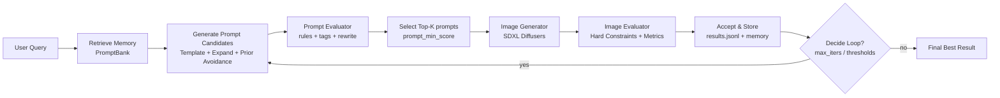

# qig_agent
# QIG-Agent 文档

## 定义

QIG-Agent 是一个面向工业批量生图的 Prompt 优化智能体：
用 LangGraph 串起 检索增强 → 规则化生成 → 多候选评估/筛选 →（少量）生图 → 图像评估 → 失败归因修复 → 记忆复用 的闭环；训练时再用 GEPA（代际演化搜索环）+ PPO（策略蒸馏环），把“搜索出来的好 Prompt”逐步蒸馏进一个小 Policy LLM，从而降低在线试错成本、提升准入率稳定性。

即：GEPA 负责探索（exploration），PPO 负责把探索成果固化成可复现能力（exploitation）

1. genetic prompt evolution（遗传式 prompt 进化）
2. reflection using natural language feedback（利用环境产生的自然语言反馈做反思式突变）

**一、系统核心架构**
1. 运行时闭环（LangGraph）
2. 训练时双环（GEPA 探索 + PPO 固化）

**二、核心功能模块**
1. PromptBank（RAG 检索增强、先验规避）：sentence-transformers/all-MiniLM-L6-v2、FAISS、SQLite+向量索引
2. Prompt Generator：Policy LLM（nucleus sampling）、GEPA Mutation LLM（遗传式进化：交叉/变异）
3. Prompt Evaluator：规则校验、0-1分制评分、自动修复
4. Image Generator：StableDiffusionXLPipeline、设备适配优化
5. Image Evaluator（Cascade）：硬约束过滤、CLIP对齐/清晰度/审美指标、LLM/VLM校准、门控策略
6. 训练模块 - GEPA环：种群进化、精英保留、多保真评估
7. 训练模块 - PPO环：Clipped PPO、Value Loss、KL penalty、Advantage计算
8. Skill Selector：UCB Bandit、冷启动策略、边际收益更新
9. Skill Library：5类Prompt修复技能（add_neg_text等）
10. Objective 总分融合：规则融合、逻辑回归Calibrator

**三、关键支撑机制**
1. 多保真评估（Multi-fidelity）
2. 重复惩罚（RepSim：Jaccard相似度）
3. 记忆复用与先验规避

)
> 层级说明：Evaluation Layer → Application Layer → Agent Layer → Memory & Data Layer

# 1. 🤔系统构成：运行时闭环 + 训练时双环

## 1.1 运行时闭环（LangGraph）

主入口示例：`src/main.py`  
Graph 在：`src/graph.py`

### ✅ 运行时闭环展示图（Mermaid）


## 1.2 训练时“双环”（GEPA + PPO）

训练脚本（双环）在：`tools/train_prompt_generator_gepa_ppo.py`  
（PPO-only 在 `tools/train_prompt_generator_ppo.py`，如果不想用GEPA）

- GEPA 环：每个 query 内先做“prompt 搜索/进化”
- PPO 环：把 GEPA 找到的高 reward prompt（+ seeds）用 PPO 更新 policy

### ✅ 双环展示图（Mermaid）
+PPO (distillation) Double-Loop)

# 2. 👍模块的关键实现

## 2.1 PromptBank（RAG 检索增强、先验规避）

文件：`src/memory/prompt_bank.py`

### 1）解决的问题
工业批量任务里，“同类任务的好 prompt”往往可复用：
检索增强 = 提高首轮命中率 + 减少随机试错 + 给模板生成提供 few-shot 软先验。

### 2）算法策略
- 句向量：sentence-transformers/all-MiniLM-L6-v2
- 相似检索：FAISS（向量近邻）
- 存储：SQLite + 向量索引

### 3）PromptBank 构成（存储层 + 向量索引层）

#### 1. 存储层：SQLite 表
```python
CREATE TABLE IF NOT EXISTS prompt_bank (
  id TEXT PRIMARY KEY,
  task_name TEXT, # 不同业务/任务隔离
  query TEXT, # 原始用户需求（用于向量检索）
  prompt TEXT, # 最终有效 prompt（可用于 few-shot/复用）
  score REAL, # 综合 objective 得分
  failure_tags TEXT, # 失败归因标签（用于统计、先验规避）
  gen_params TEXT, # 生成参数（steps/size等，做可追溯）
  fixed_prompt TEXT # 预留给“修复后的版本”（ policy fix / patch）
)
```

#### 2. 向量层：SentenceTransformer + FAISS（余弦相似度检索）
同文件里 PromptBank 初始化 embedding 模型：
并用 FAISS IndexFlatIP 做检索（`src/memory/vector_index.py`）
embedding 时用了 `normalize_embeddings=True`

**关键点**：
- 向量已归一化
- IndexFlatIP 做内积，所以检索等价于 cosine similarity
- 同时保存一个 `.ids` 文件，把 “FAISS 向量序号 → sqlite id” 对齐起来

### 4）PromptBank 实现（两个入口）

#### 数据流
```
user_query
   |
   |  (A) retrieve_similar(query)  ——>  retrieved_prompts (topK历史高分prompt)
   v
PromptGenerator: 生成 seeds
   |
   |  (B) prepend few-shot:  retrieved top prompts + 当前新生成 prompts
   |  (C) prior avoidance:   统计历史 failure_tags → 自动补充 negative
   v
候选 prompts 进入评估/筛选/生图...
   |
   |  (D) 满足 min_score → 写回 PromptBank（形成闭环记忆）
   v
下次 query 更容易“一次命中”
```

#### 1. 入口 A：graph 里检索记忆（retrieve node）
```python
# src/graph.py
db_path = str(Path(state["run_dir"]) / "prompt_bank.sqlite")
bank = PromptBank(db_path)
retrieved = bank.retrieve_similar(task_name=task_name, query=query, top_k=topk)
state["retrieved_prompts"] = retrieved
```
每个 run_dir 下都有一个独立的 `prompt_bank.sqlite`（适合做不同类别任务下的训练或对比实验）。

#### 2. 入口 B：PromptGenerator 里做 few-shot + 先验规避（用 retrieved）
```python
# src/generators/prompt_generator.py
# (B1) few-shot prepend：
if retrieved:
    top = [r["prompt"] for r in retrieved][:2]
    prompts = top + prompts

# (B2) 先验规避 prior avoidance（基于历史失败 tags 注入额外 negative）
stats = bank.stats_for_task(task_name)
failure_counts = stats.get("failure_tags", {})
neg_extra = build_prior_avoidance_negative(spec, failure_counts, top_k_tags=3)
# 追加到 Negative prompt: 后面
```

### 5）PromptBank 效果（“稳定性 + 命中率”）

#### 效果 1：提升首轮命中率（减少抽卡）
相似 query 直接复用历史高分 prompt，很多任务会从 “要修好几轮” 变成 “一轮就过”。

#### 效果 2：减少典型失败模式（先验规避）
失败标签高频意味着这条产线最常踩坑（has_text / realistic_face / blurry…）。
prior avoidance 做的事就是：第一次生成就把坑避开，不用等生图后再返工。

#### 效果 3：给 PPO/GEPA 提供更好的“起点”
哪怕 policy 还没学好，只要 PromptBank 里积累了足够多高分样本，seeds 质量会更高：
- GEPA 搜索更快收敛（初代种群更好）
- PPO 蒸馏更稳定（teacher 更容易出现）

####  ablation 实验结果
| 实验项 | 指标变化 |
|--------|----------|
| memory off → memory on | accept_rate 64.7%→94.5%（+29.8%） |
| memory off → memory on | hard_fail_rate 23.2%→12.8%（-10.4%） |
| memory off → memory on | TopK最低分 ↑0.35（质量下限更稳） |
| memory off → memory on | 平均迭代轮数 ↓1.2（更少回环） |
| prior avoidance 关闭→打开 | has_text/real_face/blurry 占比 25.6%→显著下降 |

## 2.2 Prompt Generator：混合seeds池“，两条链路并行”

（Policy LLM+GEPA mutation LLM）

### 混合seeds池想法
#### 1) “混合 seeds 池”工作原理
##### 数据流

> PromptBank：提供好的起点 + 累积好样本<br>
> Policy：提供可学习的“默认生成器”<br>
> GEPA：在难例上做搜索，生成更好的 teacher prompt<br>
> PPO：把 teacher 的模式写回 policy 参数<br>
> Store：把新 best prompt 写入 PromptBank，长期记忆不断增强

##### 实现
###### 👇policy LLM 生成seeds prompt:
1. 用固定指令模板把 user_query 包装成 prompt_in（包含规则与 Prompt: 触发词）
2. tokenizer 编码成 token ids
3. generate() 用 top-p + temperature 采样生成后续 tokens
4. decode 成文本
5. 从生成文本中截取 "Prompt:" 后面的部分作为最终 prompt 输出
6.（训练阶段）将该 prompt 作为候选，进入 evaluator → reward → PPO update

###### 👇retrieve_memory 节点：
- policy 生成 seeds → GEPA 用 LLM 改写这些 seeds → 得到 best_prompt
- 主要由 GEPA mutation/crossover 产生，加入候选池
- 输出：mutated/crossover prompts，其中一个成为 best_prompt

###### 👇生成候选阶段：
- policy 生成 `policy_seeds = policy.sample(user_query, N)`
- 同时把 retrieved_prompts 的前几条插进候选集

### 2) policy llm（ user_query 变成 prompt）

文件：`src/rl/prompt_policy.py`  
类：`PromptPolicy`
```python
class PromptPolicy:
    """
    PPO policy: 给一个 user_query，输出一个“正向 prompt”（不含多余解释）。
    """
```

#### 1. 先构造“给模型的指令”（build_input）
build_input() 把query包装成一个固定格式的英文 instruction，核心是让输出可控
policy 的“输入”其实不是 user_query 本身，而是一段稳定的 system-like instruction + User request: ... + Prompt:。

#### 2. PromptBank 作为 policy 的上下文 few-shot
- PromptBank 检索出 1~3 条相似 query 的高分 prompt
- 把它们放进 build_input() 里作为示例
- policy 生成的新 prompt 会更接近产线的风格（RAG 给“示例”，policy 学着仿写/改写）。

#### 3. PromptBank 提供 seeds / top prompts
- PromptBank 检索出 topK 历史高分 prompt
- 这些 prompt 直接进入候选池（和 policy seeds 混在一起）
- 后面统一走 evaluator / topk 生图 / reward / PPO

👉 这条路的本质：RAG 直接给“答案候选”，policy 负责补充探索。

#### PromptBank 喂给 policy 当 few-shot 的格式
```yaml
You are a professional text-to-image prompt engineer.
Rules: ...（产线的工程规则）

Here are high-quality examples for similar requests:
Example 1:
User request: <retrieved_query_1>
Prompt: <retrieved_prompt_1>

Example 2:
User request: <retrieved_query_2>
Prompt: <retrieved_prompt_2>

Now write ONE prompt for:
User request: <user_query>
Prompt:
```

#### 4. tokenization（把指令编码成模型输入）

#### 5. 用 generate() 采样生成
```python
outs = self.model.generate(
    **enc,
    max_new_tokens=int(self.cfg.max_new_tokens),
    do_sample=True,
    temperature=float(self.cfg.temperature),
    top_p=float(self.cfg.top_p),
    pad_token_id=self.tokenizer.eos_token_id,
)
```

对应 PolicyConfig 默认值：
```python
max_new_tokens = 160
temperature = 0.9
top_p = 0.92
```

**含义**：
- do_sample=True：不是贪心/beam，而是随机采样，保证探索
- temperature=0.9：偏开放，鼓励多样性
- top_p=0.92：nucleus sampling，截断尾部低概率词，避免离谱输出
- max_new_tokens=160：输出上限，防止模型长篇解释

#### 6. 后处理：只取 Prompt: 后面的部分
```python
text = self.tokenizer.decode(outs[i], skip_special_tokens=True)
if "Prompt:" in text:
    text = text.split("Prompt:", 1)[-1].strip()
results.append(text.strip())
```

### 3）GEPA Mutation LLM
- seed prompt：来自 Policy LLM（PPO+GEPA训练）（比如demo的 Qwen2.5-1.5B-Instruct + LoRA + PPO）
- GEPA 的改写/变异：来自 另一个 LLM（ qwen 4b）（黑盒，用来做 mutation/crossover）

> policy 生成 seeds → GEPA 用 qwen4b 改写这些 seeds → 得到 best_prompt

#### 1. 代际演化（ population>1，多种群并行，防止局部最优）
当 population_size>1 时，典型流程：
1. 初始化：拿 policy seeds +（可选）prompt bank +（可选）随机变异扩充
2. 评估整代：对每个 prompt 算 fitness
3. 选精英：top-elite_frac 保留
4. 生成下一代：
   - 从精英/前半池抽父代
   - mutation（LLM 改写 / skills patch）
   - crossover（把两个 prompt 的优点合并）
5. 进入下一代，重复 N 代

#### 2. prompt池 在GEPA后的构成
运行/训练中会出现两类 prompt：

##### A) seeds（初始候选）
- prompt来自 policy LLM
- 代码路径：`policy.sample(user_query, ...)`
- 输出：seed prompts

##### B) evolved prompts（进化出来的候选、含 best_prompt）
- 主要由 GEPA mutation/crossover 产生，加入候选池
- mutation 的来源通常是qwen 4b
- 输出：mutated/crossover prompts，其中一个成为 best_prompt

**分工设计**：
- policy：负责稳定、低成本地产 seed（并且能被 PPO 更新）
- qwen4b（GEPA LLM）：负责搜索/改写

> “LLM mutation 是搜索器，policy 是记忆器/生成器”

## 2.3 Prompt Evaluator（低成本 reward / tags / rewrite）

文件：`src/evaluators/prompt_evaluator.py`

### 输入/输出示例
- 输入：spec, user_query, prompts
- 输出：每条 prompt 一个 dict：
  - score ∈ [0,1]
  - hard_fail: bool
  - tags: [...]
  - rewrite: str | None（自动补齐 negative）

### 关键策略示例
1. 必须有 xxx
2. 禁止解释/hashtag
3. 长度限制（字符数 + 词数）
4. 禁词（政治/水印/二维码等）
5. 如果缺 negative，会做 rewrite 补齐

### 核心实现片段
```python
# src/evaluators/prompt_evaluator.py
if "Negative prompt:" not in p:
    tags.append("missing_negative")
    hard_fail = True
    rewrite = _ensure_negative(spec, p)

# 基础分从 0.60 起（合格线）
score = 0.60
if not hard_fail: score += 0.10
if n_words <= 50: score += 0.10
if len(p) <= 240: score += 0.10
if "Negative prompt:" in p and len(neg.strip()) >= 8: score += 0.10
if any(b in p.lower() for b in ban_list): hard_fail=True; score -= 0.40
score = max(0.0, min(1.0, score))
```

## 2.4 Image Generator

文件：`src/generators/image_generator.py`

### 关键修复（显存问题）
offload 时 decode device 不一致导致的隐性崩溃/显存问题：
latents decode 要跟随 pipe 的真实执行设备（pipe._execution_device）
```python
# src/generators/image_generator.py (关键片段)
self.pipe = StableDiffusionXLPipeline.from_pretrained(model_id, torch_dtype=fp16...)
if self.enable_cpu_offload:
    self.pipe.enable_model_cpu_offload()
...
exec_device = getattr(self.pipe, "_execution_device", self.device)
latents = latents.to(exec_device)  # ✅关键：避免 offload 时 device mismatch
```

## 2.5 Image Evaluator（Cascade：硬约束 + 指标化分数）

文件：`src/evaluators/image_evaluator.py`

 L3 Judge))

### Layer1：Hard constraints（确定性过滤）
- 输入： prompt + image
- 输出： hard_fail: bool + tags_hard: [...]

**示例约束**：
- has_text / watermark / logo
- realistic_face / real human face
- severe blur / broken image

**原则**： Layer1 必须快、确定，筛出不符合硬规定的数据。

**实现片段**：
```python
# src/evaluators/image_evaluator.py (关键片段)
pen_has_text = 0.60
pen_has_face = 0.90
pen_blurry   = 0.50

if detect_text_simple(img):
   tags.append("has_text"); penalty += pen_has_text; hard_fail=True
if detect_realistic_face(img, thresh=0.65):
   tags.append("has_face"); penalty += pen_has_face; hard_fail=True
if sharpness_raw < 60:
   tags.append("blurry"); penalty += pen_blurry
```

> 注意：这里 hard_fail=True 只对 text/face，blurry 只是 penalty（更柔性）。

### Layer2：Numerical metrics（连续 reward 信号）
- 输入： prompt + image（通过 Layer1 的样本）
- 输出： metrics + score_l2 ∈ [0,1] + tags_soft

**指标**：
- clip alignment（语义对齐）
- sharpness（清晰度）
- aesthetic（审美/风格 proxy）
- penalties（对 tags 的惩罚项）

**原则**： Layer2 给 PPO/GEPA 提供“密集连续”reward，训练才会收敛。

### Layer3：LLM/VLM judge（稀疏、高质量校准）
- 输入： user_query + prompt + image + Layer1/2 的 tags 和 metrics 摘要
- 输出： judge_score ∈ [0,1] + dims + risk_flags + explanations

**原则**： Layer3 只在少量样本上用，用来：
1. 校准 Layer2 的盲区（比如 aesthetic、CLIP 的误判）
2. 在候选之间“裁决谁更符合业务审美/版式”
3. 产生可学习数据（pairwise preference），后面训练一个便宜版 ranker 逐步替代它

### 门控策略

#### Gate A：决定“是否生图”（进入 image evaluator）
1. 先过滤 prompt hard_fail（格式不对、禁词等）
2. 对剩余按 prompt_score 排序
3. 取 topk_img 生图
4. 其它候选：只用 prompt reward（multi-fidelity 省钱阀门）

**作用**：控制数据是否进入 Layer1/2。

#### Gate B：决定“是否进入 Layer3”
Layer3 的门控: “三段式”：硬条件 + 不确定区间 + 预算。

##### Gate B 的输入
- hard_fail（Layer1）
- score_l2（Layer2）
- tags（Layer1/2）
- 当前是 GEPA 还是 PPO（训练/推理）
- 当前候选在本轮的排名 rank
- 本轮预算 budget（eg. 最多调用 2 次 judge）

##### Gate B 规则
1. hard gate：如果 hard_fail=True → 不进 Layer3（直接判死）
2. uncertainty gate：
   - 如果 score_l2 >= τ_high → 不进 Layer3（已经很高分，没必要）
   - 如果 score_l2 <= τ_low → 不进 Layer3（已经很差，没必要）
   - 只有当 score_l2 ∈ [τ_low, τ_high] 才进 Layer3（不确定区间）
3. ranking gate（只裁决精英）：只对本轮 TopM（比如 Top2 / Top4）做 Layer3
4. 预算 gate：每个 episode 最多 judge 次数 B（1、2、3....）+ 全局频率 p（比如 3%）

### Layer3 的融合方式
“校准纠偏型”融合：Layer2 仍是主信号，Layer3 只负责纠偏
- 若不触发 Layer3：score = score_l2
- 若触发 Layer3：score = (1 - α)·score_l2 + α·score_l3（α 取 0.1-0.2 最佳）

**优点**：训练仍以密集 L2 为主，L3 提供高质量对齐，不会把 PPO 训练变稀疏。

### 完整数据流
以一次 query 的训练 episode 为例：
1. policy 生成 N 个 seeds
2. prompt_eval（cheap）全量 → 得到 prompt_score / tags
3. Gate A：选 topk_img 生图
4. 对这些图进入 image evaluator：
   - Layer1：hard detectors → hard_fail / tags_hard
   - Layer2：continuous metrics → score_l2 / tags_soft
   - Gate B：判断是否触发 Layer3
   - Layer3：judge → score_l3 / dims / flags
   - 融合：final_score
5. combine_reward（加 length/dup/hard_fail penalty）
6. GEPA 用 reward 选精英；PPO 用 reward 更新 policy
7. best_prompt / accepted 样本写回 prompt bank（形成闭环）

## 2.6 image score: Objective 总分融合 + 逻辑回归融合 Calibrator

文件：`src/evaluators/objective.py`

### 规则融合（rule-based）
从 spec 里读权重，示例：
- clip / sharp / aesthetic 加权加和
- has_text / realistic_face / blurry 等触发就扣分（甚至 hard_fail 直接压死）

**优势**：
- 可控、可解释、上线稳定
- 你能保证“产线红线”一定被惩罚

### 学习式融合（reward calibrator，可选）
如果存在 `configs/reward_calibrator.joblib`，objective 会额外：
1. 把多维指标拼成 feature 向量 x
2. 用逻辑回归（或你训练的模型）输出一个概率 p = P(accept|x)
3. 再把它和 rule score blend：S = (1 - α)·S_rule + α·p

**意义**：
- 让“融合权重”从手写变成贴近真实准入规则
- 对一些复杂失败模式更敏感

### 关键效果展示
- 成功率/准入率：results.jsonl 里的 score、hard_fail、tags
- 失败模式分布：tags 统计（blurry/has_text/has_face）
- 闭环是不是生效：loop_iter 增长、autofix 生效（prompt rewrite）
- 是否抽卡降低：TopK 的最低分是否上升（质量下限更稳）

# 3. 双环训练：PPO + GEPA 的构造、公式、参数、数据流

## 3.1 训练数据构造

#### A) results.jsonl（运行时/评估产生）
- Graph 每次 run 会 append 记录（包括 metrics/tags/score）
- Reward calibrator 训练脚本会在 runs/ 下递归搜集所有 results.jsonl

对应脚本：`tools/train_reward_calibrator.py`
```python
for p in runs.glob("**/results.jsonl"):
  for line in p: items.append(json.loads(line))
```

#### B) train_log.jsonl（训练时 PPO/GEPA 产生）
双环脚本会写训练日志（用于 `tools/analyze_train_log.py` 分析）。

## 3.2 Reward 总公式
Reward 组合在：`src/rl/reward.py`

表达式：
$$ R = w_{prompt} \cdot S_{prompt} + w_{image} \cdot S_{image} \cdot \mathbb{I}_{gen} - Penalty_{hard\_fail} - Penalty_{len} - Penalty_{rep} $$

其中：
- $S_{prompt}$：Prompt Evaluator 的分数（[0,1]）
- $S_{image}$：Image Evaluator 的 objective 分数（[0,1]）
- $\mathbb{I}_{gen}$：是否进入 TopK 生图（multi-fidelity 省钱阀门）
- $Penalty_{rep}$：重复惩罚（RepSim：Jaccard 相似度）
- $Penalty_{len}$：长度偏离 target 的惩罚（控制 CLIP/SDXL 适配）

## 3.3 Multi-fidelity 门控阀门
双环训练中：
- 对全部候选先算 prompt_score
- 只对前 topk_to_generate_images 的候选跑 生图 + image_eval

配置文件（`configs/gepa_ppo_prompt.yaml`）：
```yaml
multi_fidelity:
  num_prompt_candidates: xx
  topk_to_generate_images: xx
  images_per_prompt: xxx
```

## 3.4 RepSim（重复惩罚）
双环训练里用 Jaccard 相似度近似重复度：
$$ RepSim = \frac{|A \cap B|}{|A \cup B|} $$
再进入 reward：$Penalty_{rep} = \lambda_{rep} \cdot RepSim$

**优点**：
- 不用 embedding，不用额外模型
- 纯集合运算，快速、成本低
- 对“模板化 prompt 变成一模一样”的退化有强抑制

## 双环数据流总图
```
user_query
   │
   ▼
Policy LLM (sample K prompts)  ──────► seeds[]
   │                               │
   │                               ▼
   │                        GEPA Optimize (E generations)
   │                               │
   │                               ▼
   │                         best_prompt, best_reward
   │                               │
   ▼                               ▼
PPO Rollout batch = [best_prompt + seeds]
   │
   ▼
PromptEval (cheap) -> topK -> ImageGen+ImageEval (expensive)
   │
   ▼
Reward shaping (combine_reward)
   │
   ▼
PPO Update -> Policy LLM improves
   │
   └────────────── next update repeats ───────────────
```

# 4. PPO 环：公式、步骤

PPO 更新在：`tools/train_prompt_generator_gepa_ppo.py` 的 `ppo_update_step`
实现： clipped PPO + value loss + KL penalty。

## 4.1 PPO 的关键定义

#### (1) Advantage（demo：一步 advantage）
$$ A = R - V_{old}(s) $$

#### (2) Ratio
$$ r(θ) = exp\left( log \pi_θ(a|s) - log \pi_{θ_{old}}(a|s) \right) $$

#### (3) Clipped surrogate objective
$$ L_{clip} = -\mathbb{E}\left[ min\left( r(θ) \cdot A, clip(r(θ), 1-\epsilon, 1+\epsilon) \cdot A \right) \right] $$

#### (4) Value loss
$$ L_V = \mathbb{E}\left[ (V(s) - R)^2 \right] $$

#### (5) Approx KL penalty
$$ KL \approx \mathbb{E}\left[ log \pi_{θ_{old}}(a|s) - log \pi_θ(a|s) \right] $$

#### 最终 loss
$$ L = L_{clip} + c_V \cdot L_V + c_KL \cdot KL $$

> “把 reward 和 baseline（value）做差，得到这次生成的 prompt 相对平均水平的好坏；然后用 PPO 的 ratio+clip 机制，稳健地提高好 prompt 的生成概率、降低差 prompt 的生成概率，同时训练 value head 变得更准，并用 KL/clip 防止更新过猛。”

## 4.2 后续提升：把“修复闭环”纳入 policy（真正多步 ，用GAE ）

###  episode 定义
“最多 T 轮的提示词优化”，policy 在一个 episode 里多次出手，形成：
- $s_t$：包含 query + 当前 prompt + 最近一次 tags/metrics + 预算剩余（次数）
- $a_t$：policy 输出“下一版 prompt”
- $r_t$：本轮 reward（prompt_score + image_score 的组合）
- $done$：达到 accept / 达到 max_steps / hard_fail 终止

### 状态输入
每一步输入给 policy 的文本包含：
- 原始 user_query
- 当前 prompt（上一轮输出）
- 上一轮评估摘要：tags + 关键数值（clip/sharp/aesthetic/score）
- 还剩几轮预算
- 任务硬约束（no text/no real face…）

### 轨迹奖励
- 每一步 reward：用现有 combine_reward()（cheap+expensive 多保真）
- 终止时 bonus：
  - accept 给 +b（例如 +0.5）
  - 超预算/失败给 -b（例如 -0.5）

### GAE 公式
对每条 episode，倒序算：
$$ \delta_t = r_t + (1 - d_t) \gamma V(s_{t+1}) - V(s_t) $$
$$ A_t = \delta_t + \gamma (1 - d_t) \lambda A_{t+1} $$
$$ R_{return} = A_t + V(s_t) $$

其中 $d_t=1$ 表示终止。

### PPO 更新
- advantages 做 normalize
- returns 用来训练 value head（MSE）
- PPO clipped loss 形式不变：
  $$ L_{clip} = -\mathbb{E}\left[ min\left( r(θ) \cdot A_t, clip(r(θ), 1-\epsilon, 1+\epsilon) \cdot A_t \right) \right] $$
- value loss：
  $$ L_V = \mathbb{E}\left[ (V(s_t) - R_{return})^2 \right] $$

# 5. GEPA 环：生成式进化算法环

GEPA 在：`src/llm/gepa_optimizer.py`

- Population：一组 prompt
- Fitness：reward
- Selection：保留 topN
- Crossover：拼接/交换 prompt 片段（让子代继承优点）
- Mutation（两类）：
  a. skill mutation：看到 tag 就执行技能修复
  b. llm mutation：调用 LLM 直接 rewrite（更强但更贵）

并且它会把 patch 记录进 memory（`TrajectoryMemory.record_patch()`），用于复盘分析。

## 5.1 GEPA 的核心对象（dataclass）
```python
@dataclass
class GEPAConfig:
    population_size: int = 12
    generations: int = 5
    elite_size: int = 3
    crossover_rate: float = 0.35
    mutation_rate: float = 0.90
    llm_mutation_rate: float = 0.65
    max_words: int = 45
    image_eval_topk: int = 3
    images_per_prompt: int = 1
```

> 可以看到：GEPAConfig 本身已经是一个清晰的“进化搜索控制面板”。

## 5.2 GEPA 的每一代（generation）演化过程

### 1）种群与精英保留
- 初始化种群 = seeds + 一些变异扩充
- 每一代：
  1. 评估整个 prompt池（prompt_eval 全量 + topk 生图）
  2. 对于每个种群，取前 elite_frac 作为精英
  3. 用精英生成下一代（crossover + mutation）：使用LLM做变异/改写等。

### 2）crossover / mutation 的来源：LLM + fallback skills
GEPA 的关键创新点是：不是随机噪声突变，而是“LLM 生成式突变”：
- 优先用 LLM 做“语义合理的变异”
- 如果 LLM 输出空/格式异常，就 fallback 到 rule-based 技能库 patch

### 3）GEPA 的 multi-fidelity 评估
`_eval_population()` 的逻辑是：
- 对全体 prompts 做 prompt_score
- 只对前 topk_img 做生图 + image_score
- 然后用 combine_reward() 得到每条 prompt 的 reward
- 得分达到阈值的子代加入prompt池

## 示例：GEPA 搜索 → PPO 蒸馏流程

### 场景设定
user_query：
> “生成一张3d风汉朝将军的威严画像，写实插画风格，不能有文字，不能像真人脸，背景不要复杂，高清”

工业约束：
- 禁止文字（has_text）
- 禁止逼真真人脸（realistic_face）
- 不要模糊（blurry）
- prompt 要紧凑、不要解释
- 最好有负向词（negative prompt）

### Step 1：Policy LLM 先产 seeds（初始可能很普通）
假设采样出 4 个 seeds：
| seed | prompt 内容 | prompt_eval 得分 | tags |
|------|-------------|------------------|------|
| S1 | "A powerful Han dynasty general, realistic illustration, detailed armor, cinematic lighting, ultra high resolution." | 0.65 | missing_negative |
| S2 | "Portrait of a Han dynasty general, stern expression, realistic style, high detail, sharp focus." | 0.60 | missing_negative, risk_realistic_face |
| S3 | "Han dynasty general standing, historical costume, epic atmosphere, realistic painting." | 0.62 | missing_negative |
| S4 | "A realistic Han dynasty warrior general, close-up, highly detailed face, 8k." | 0.58 | missing_negative, high_risk_realistic_face |

> 此时 policy 没学会“约束输出”，直接生图可能触发 hard_fail。

### Step 2：GEPA 开始“进化搜索”（teacher 的来源）
GEPA 把 seeds 当初代种群，针对 tags 做 mutation / crossover：

#### 3.1 依据 tag 做 mutation
从 S2 变异出 M1（消掉风险点）：
> "A stern Han dynasty general in ornate lamellar armor, heroic and stylized, realistic illustration but not photorealistic, cinematic rim light, clean simple background, sharp details, high quality. Negative prompt: text, watermark, logo, photorealistic face, realistic portrait, extra fingers, blurry."

从 S1 变异出 M2：
> "Han dynasty general, historical armor, heroic posture, realistic illustration, no inscriptions, minimal background, high clarity, cinematic lighting. Negative prompt: any text, watermark, logo, signature, photorealistic face, close-up portrait, blur."

#### 3.2 crossover 交叉（拼接优点）
S1 的“威严+电影光” + M1 的“非写实脸+负向词” → C1：
> "A mighty Han dynasty general, imposing presence, ornate lamellar armor, epic cinematic lighting, realistic illustration stylized, clean background, high sharpness. Negative prompt: text, watermark, logo, signature, photorealistic face, portrait closeup, blur, lowres."

### Step 4：GEPA 再评估，选出 best_prompt（teacher）
| 候选 | prompt 内容 | prompt_eval 得分 | image_score | 最终 reward |
|------|-------------|------------------|-------------|-------------|
| C1 | 上述 crossover 结果 | 0.85 | 0.74 | 0.74 |
| M1 | 上述 mutation 结果 | 0.80 | 0.68 | 0.66 |
| M2 | 上述 mutation 结果 | 0.78 | 0.65 | 0.63 |

> best_prompt = C1（高 reward，无 hard_fail）

### Step 5：PPO 蒸馏 teacher
PPO batch 包含 [C1 + S1~S4]，根据 reward 更新 policy：
- C1 高 reward → adv 正 → PPO 提高其生成概率
- S2/S4 低 reward → adv 负 → PPO 降低其生成概率

### Step 6：下一轮 policy 输出变化
训练后，policy 直接生成符合约束的 prompt：
> "A mighty Han dynasty general, imposing presence, ornate lamellar armor, epic cinematic rim lighting, stylized realistic illustration, clean minimal background, high sharpness. Negative prompt: text, watermark, logo, photorealistic face, portrait closeup, blur."

# 6 Skill Selector：UCB（bandit）选技能

src/agent/skill_selector.py

核心是 UCB：
$$ UCB(i) = \bar{r}_i + c \cdot \sqrt{\frac{log(N)}{n_i}} $$
- $\bar{r}_i$：技能i的历史平均收益(成功/score)
- $n_i$：技能i被选次数
- $N$：总尝试次数
- $c$：探索系数(配置里叫ucb_c)

对应代码（关键行）：
```python
# src/agent/skill_selector.py
bonus = self.c * math.sqrt(math.log(max(1, self.total_tries)) / float(st.n))
v = st.mean_gain + bonus
```

## 6.1 cold-start 冷启动
```python
for s in skill_names:
    if self.stats.get(s, SkillStats()).n == 0:
        return s
```
> 原因：某个技能没用过，优先试一次，避免局部最优。

## 6.2 探索系数c
```python
# tools/train_prompt_generator_gepa_ppo.py
selector = SkillSelector(c=float(cfg["skills"].get("ucb_c", 1.4)))
```

## 6.3 “reward_gain”
UCB 用的是边际收益：
$$ reward\_gain = R_{after} - R_{before} $$

#### 流程：
1. 选 skill 技能
2. apply skill 得到新 prompt
3. 重新评估（prompt_score / image_score / reward）
4. gain = after - before
5. selector.update(skill, gain) 更新均值与次数

## 6.4 工具/技能（SkillLibrary ）

文件：`src/agent/skill_library.py`，内置 5 个技能：

### ① add_neg_text：强力禁止文字/水印
- 触发 tags：need_neg_text, hard_forbid_text, pos_mentions_text_overlay
- 作用：往 negative prompt 里补关键词
```python
name="add_neg_text"
tokens=["text","watermark","logo","signature","caption","subtitle"]
```

### ② add_neg_realistic_face：只禁真人脸
- 触发 tags：need_neg_realistic_face, hard_forbid_realistic_face, pos_mentions_real_face
```python
tokens=[
 "real human","portrait photo","photorealistic face",
 "realistic face","human face","skin texture","real person"
]
```

### ③ remove_pos_text_words：删除正向“引导出字”的词
- 触发 tags：pos_mentions_text_overlay
- 作用：正向 prompt 删除 watermark/logo/text 等

### ④ expand_prompt：太短补质量词+构图词
- 触发 tags：prompt_too_short
- 作用：加固定增强描述（高质量、电影光、干净构图等）

### ⑤ shorten_prompt：太长截断
- 触发 tags：clip_trunc_risk
- 作用：控制正向 prompt 最大词数（默认 110）

## 6.5 技能调用逻辑
在 `src/llm/gepa_optimizer.py` 中，GEPA 做 mutation 时：
1. LLM 找到与 tags 匹配的可用技能：`available_skills_for_tags(tags)`
2. 规范化成技能名列表
3. 应用技能

## 6.6 UCB在mutation中的演进
伪逻辑：
```
parent_reward = reward_map[parent]["reward"]
child_reward = evaluate(child)
gain = child_reward - parent_reward
selector.update(skill, gain)
```
UCB 会逐渐偏好对某类 tags 最有效的 skill。

---

### 图片存放说明
将文档中的图片（Fig.A、Fig.2、Fig.8 等）保存到仓库的 `assets/img/` 目录下，然后修改图片引用路径为：
```markdown

```
确保 GitHub 能正常加载图片。
